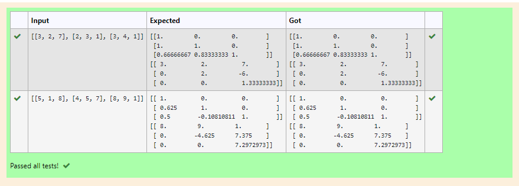
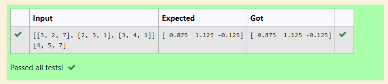

# LU Decomposition without zero on the diagonal

## AIM:
To write a program to find the LU Decomposition of a matrix.

## Equipments Required:
1. Hardware – PCs
2. Anaconda – Python 3.7 Installation / Moodle-Code Runner

## Algorithm
### 1.Import numpy package.
### 2.From scipy package import lu.
### 3.Get input from the user. 
### 4.Print result.

## Program:
```
/*
Program to find the LU Decomposition of a matrix.
Developed by: Meenakshi M
RegisterNumber: 21003572
*/
# To print L and U matrix
import numpy as np
import scipy
from scipy.linalg import lu
a=np.array(eval(input()))
p,l,u=lu(a)
print(l)
print(u)

# To print X matrix (solution to the equations)
import numpy as np
from scipy.linalg import lu_factor,lu_solve 
a=np.array([[3, 2, 7], [2, 3, 1], [3, 4, 1]])
b=np.array([4, 5, 7])
lu,piv=lu_factor(a)
x=lu_solve((lu,piv),b)
print(x)
```

## Output:






## Result:
Thus the program to find the LU Decomposition of a matrix is written and verified using python programming.

